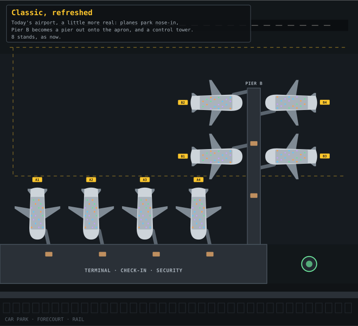
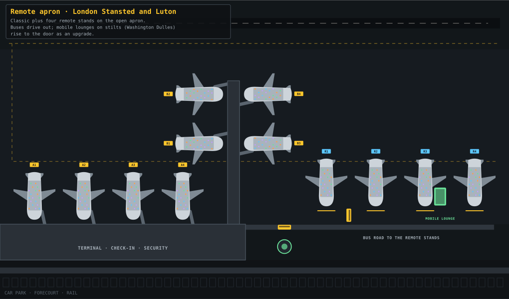
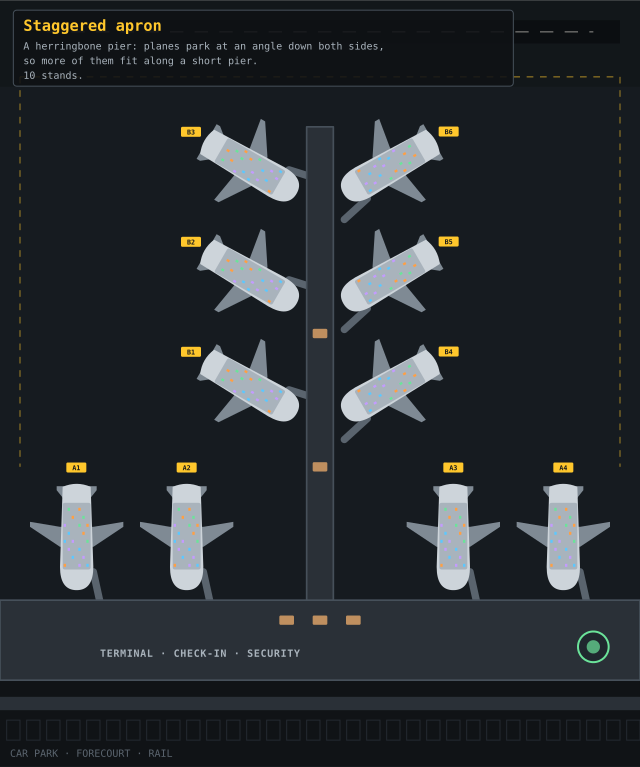
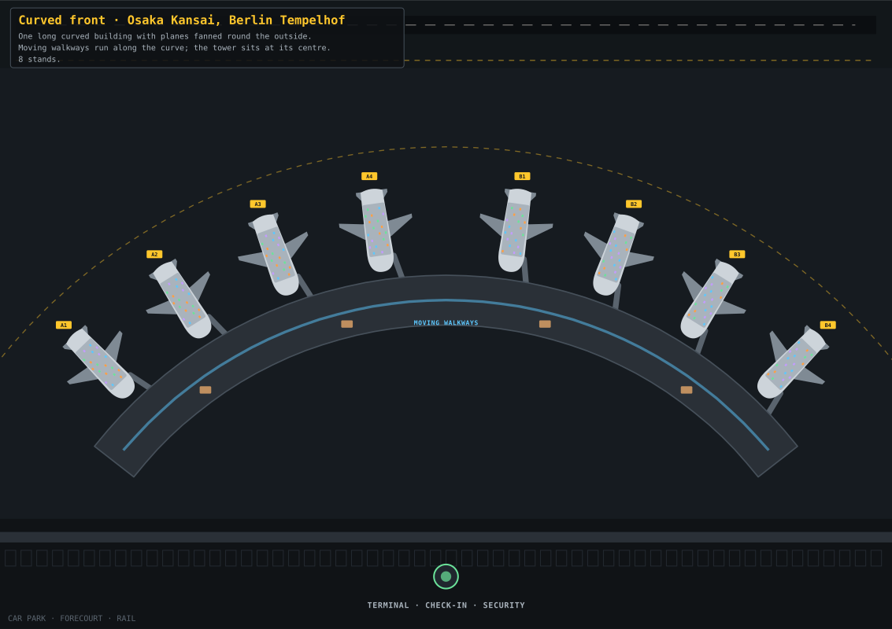
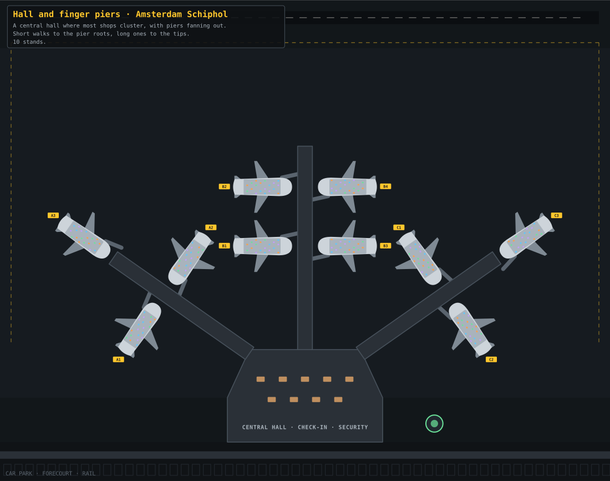
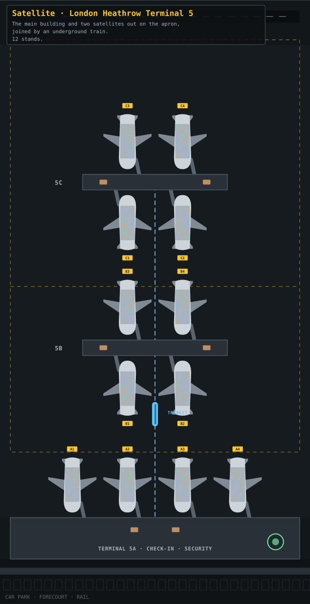
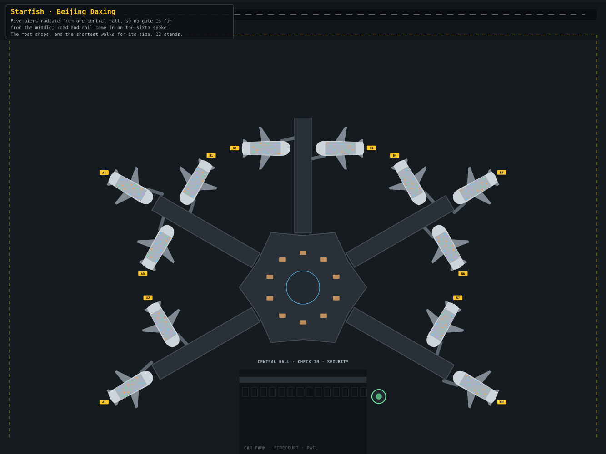
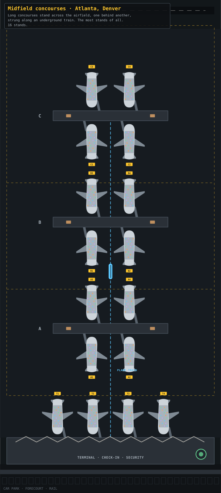
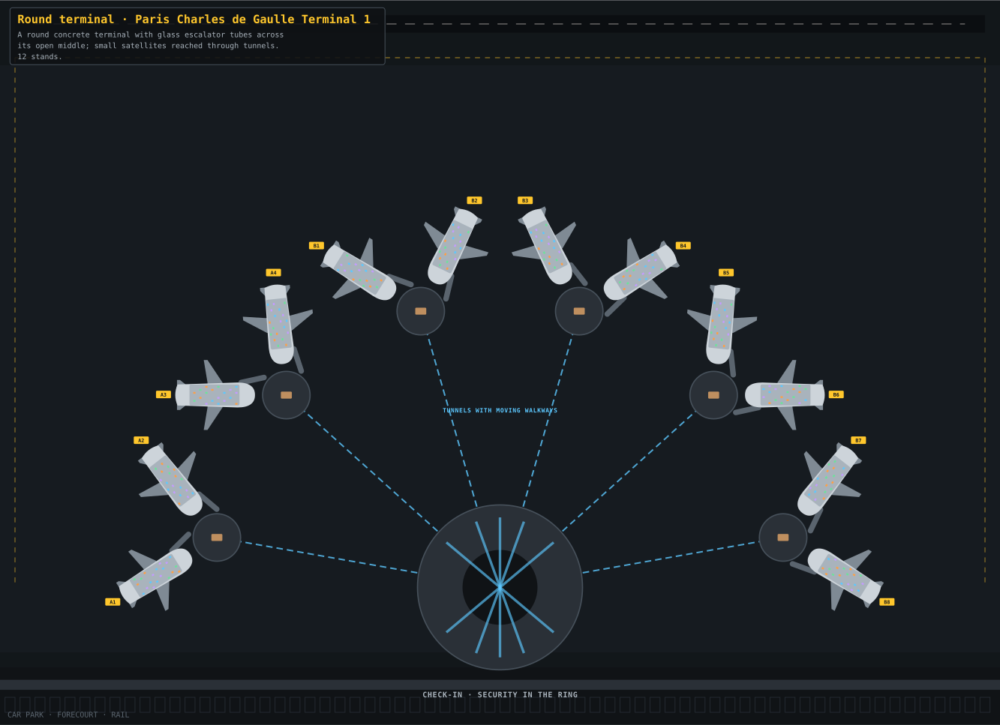

# Real airport shapes

Issue: #10 · Status: Built · PRs: #11, #12, #13, #14

Follows #7, which shipped the layouts along one straight corridor.

## What the player gets

Layouts that look like the real airports they're named after:
- piers pointing out at angles;
- satellites standing on their own out on the apron;
- midfield concourses strung along an underground train;
- a star-shaped terminal.

A few of the world's oddest real airports join them. The layouts keep their unlocks, rebuilding and roughly their balance, but each one looks and plays differently because passengers really walk, ride and queue through its shape.

## What they see

- **On the map:**
  - Planes park nose-in at any angle around piers, halls and satellites.
  - They taxi in from the runway along real taxiways.
  - Passengers walk the corridors, stand on moving walkways, wait at train stations and ride out to satellites.
  - Buses drive across the apron to remote stands.
  - The map is as tall as the layout needs, and the camera pans both ways.
- **Nose-in parking:** planes park nose-in with a short bridge to the front door, as at real airports. Today they park tail-in, with a long bridge down the side.
- **Unchanged:**
  - Landside (car park, check-in, security) stays along the bottom of the main building.
  - Boarding inside the cabin still works seat by seat, just drawn rotated.
- **In the panel:** Airfield › Layout shows each layout's real outline in its small plan.
- **On phones:** tall layouts fit portrait screens better than today's long strip. "All" zooms to fit, and gate buttons fly the camera to each stand.

## The layouts

Concept plans of every layout are below. `airport-shapes/plans.mjs` redraws them and fails if any plane hits another plane or a building.

| Layout (same id as now) | Modelled on | Shape | Stands | Upside | Downside |
| --- | --- | --- | --- | --- | --- |
| **Classic, refreshed** | today's airport, made a little more real | the same straight terminal and A gates; Pier B becomes a pier out onto the apron; a control tower | 8 | balanced | a walk out along Pier B |
| **Remote apron** | London Stansted and Luton | Classic plus a row of remote stands on the open apron, reached by a bus road | 8 + 4 remote | the cheapest extra stands | bus rides, worse in bad weather |
| **Staggered apron** | your concept | a pier running out from the terminal with planes parked at an angle along both sides, like a herringbone | 10 | more stands on a short pier | planes block each other when they push back |
| **Curved front** | Osaka Kansai's 1.7 km curved wing, and Berlin Tempelhof's arc | an arc, with planes fanned round the outside and the control tower at its centre | 8 | the shortest walks and a rating bonus | no extra stands |
| **Hall and finger pier** | Amsterdam Schiphol | central lounges with shops, and piers fanning out at angles | 10 | the best shop spend | long walks to the pier ends |
| **Satellite** | London Heathrow Terminal 5 | the main building plus two satellites out on the apron, joined by an underground train | 12 | big duty-free, quick transfers | a train ride before boarding |
| **Starfish** | Beijing Daxing | five short piers radiating from a central hall | 12 | the shortest walks for its size and the most shops | the costliest to build and run |
| **Midfield concourses** (new) | Atlanta and Denver | parallel concourses across the airfield, strung along a train | 16 | the most stands of all | the longest train rides; costly |

## The odd ones

Real airports with strange ideas that work as game mechanics. The owner approved the first two for this work; the others stay ideas.

- **Round terminal (new layout)**, from Paris Charles de Gaulle Terminal 1.
  - A round concrete terminal with glass escalator tubes criss-crossing its open middle.
  - Six small satellites are reached through tunnels under the apron (the real one has seven).
  - Upside: lots of stands in little space, and the tubes lift the rating.
  - Downside: each satellite has only a kiosk or two of shops.
- **Mobile lounges (a Remote apron upgrade)**, from Washington Dulles.
  - Lounges on stilts drive out to the plane and rise to the door.
  - Remote boarding becomes as quick as a bridge, whatever the weather.
- **Drive-to-gate rings (an idea for later)**, from Kansas City's old terminals.
  - Ring-shaped terminals where you park about 25 m from your gate.
  - Security sits at every gate, so walks are tiny but staffing costs much more.
  - It changes how landside works, so it's a bigger job than the others.
- **A forest or a waterfall (an idea for later)**, from Kuala Lumpur and Singapore Changi.
  - Kuala Lumpur has a patch of rainforest inside its satellite; Singapore Changi's Jewel has a 40 m indoor waterfall.
  - Either would lift the rating and shop spend in a hall.

## In pictures

Concept plans, drawn to the game's scale and colours. Yellow tags are gates on bridges and blue tags are remote stands. Dashed blue lines are trains and tunnels, and dashed yellow lines are taxiways.

| | |
| --- | --- |
|  |  |
|  |  |
|  |  |
|  |  |
|  | |

## How it works

- **A plan instead of a line.** Each layout lists:
  - stands with a position and heading;
  - buildings;
  - a network of corridors;
  - special links: moving walkways, trains (stations, a car that shuttles, a capacity) and bus lanes;
  - a taxi route from the runway to every stand.
- **Walking.** After security, passengers follow the shortest route to their gate. Walking time comes from the real route length. Queues, lounges and shops sit along the routes.
- **Planes.** They're drawn rotated to their stand's heading. Seats, doors and bridges are worked out in the plane's own frame, so boarding code is shared by every angle.
- **Classic first.**
  - Today's Classic is moved onto the new system unchanged, and must end in exactly the same state on seeds 1–3 as before. That's how the last refactor was proven.
  - Only then does Classic get its refresh. The bot checks that a player who keeps it still paces within the baselines.
- **Room for more airports later.**
  - An airport becomes one object built from its layout: its plan, stands and people.
  - The code reads "this airport" instead of shared arrays, so a second airport later is another object, not a rewrite.
  - Today's saved fields stay as they are.
  - Nothing about running a second airport is built now.
- **Speed.**
  - Routes are worked out once per layout, not per passenger.
  - The `perf` check keeps its budget, so a 16-stand airport must stay at full speed on a phone.

## Saved state

- **New values:** `G.layout` gains `midfield` and `round`.
- **Stands:** the stand list grows to 16 (`NG`), padded by `resetAll` as it is now.
- **Runtime only:** trains, buses and routes aren't saved.
- **Nothing is renamed or removed.** Saves in any of today's layouts load into its new shape. Planes and passengers move across as they do in a rebuild.

## Balance

- A player who keeps Classic paces as today, within the baselines. The refresh changes walks to Pier B a little.
- Walking times change with the real shapes, so each layout is retuned with the bot.
- The target stays the same: rebuilding well reaches level 9 about 5–10% sooner.
- Midfield concourses unlock at level 9 as the alternative to Starfish: more stands, longer rides.

## Results

- **Built in four PRs** (#11, #12, #13 and the mobile lounges), versions 23 to 26.
- **Proofs that the game is unchanged:**
  - the step that adds stand frames and rooms;
  - the removal of the straight-line code.

  Both end in exactly the same state on seeds 1–3, keeping Classic and rebuilding.
- **Keeping Classic** reaches level 9 at 1086, 1091 and 1088 on seeds 1–3, inside the baselines (before: 1109, 1076 and 1085).
- **Rebuilding** (Remote apron with mobile lounges, then Satellite, then Starfish) reaches level 9 at 988, 978 and 973, about 10% sooner.
- **Each layout on its own** (seed 1): Staggered apron 1019, Hall and finger pier 1033, Curved front 1073 (it gains early, not late), Round terminal 1074. Midfield, Satellite and Starfish are end-game layouts.
- **Speed:**
  - A fully built sixteen-stand Midfield simulates about 2.5 times slower than Classic, within the check's budget.
  - On a phone with the CPU slowed 4×, Classic holds 7.7 of 8 game minutes a second at 8×, and Midfield reaches 3.7. It doesn't yet hold full speed on a slow phone. That's logged on the roadmap as "Speed for the biggest airports".

## Checks

- **`rules`:**
  - every stand is reachable from security and from the runway;
  - no stands, buildings or taxiways overlap (rotated outlines);
  - route lengths match the drawing;
  - trains and buses deliver everyone they pick up.
- **`layouts`:** every layout plays two hours fully built, at phone, tablet and desktop sizes. Screenshots of each.
- **`perf`:** a 16-stand Midfield airport at level 9.

## Files

- **New:** `src/game/41-airside.js` for the corridor network, routes, trains and buses.
- **Changed:**
  - `04-geometry` (stands with headings);
  - `07-passengers` (walking routes);
  - `08-stands` (taxiing, bridges at any angle);
  - `12-drawing` and `40-layout-drawing` (rotated planes and buildings);
  - `13-camera` (a map sized by the layout);
  - `39-layouts` (the plans).

## Order of work

Each step is its own PR, proven before the next:
1. **The new system with Classic on it,** proven identical, then Classic's refresh.
2. **Remote apron, Staggered apron, Curved front, and Hall and finger pier** in their real shapes.
3. **Satellite, Starfish, Midfield concourses and the Round terminal,** with trains.
4. **Mobile lounges,** then balance with the bot on seeds 1–3, and screenshots.

## Left out

- **Running more than one airport.** This leaves room for it and no more.
- **Odd airports as places.** Some would suit a second airport one day:
  - Gibraltar, with a road across its runway that closes for every landing;
  - Barra, where planes land on a beach and the timetable follows the tide;
  - Madeira, whose runway stands on pillars over the sea;
  - Lukla, a short, sloping runway on a mountainside;
  - Princess Juliana, where planes cross the beach just above the sunbathers.
- **Runway, airspace and region:** they don't change.
