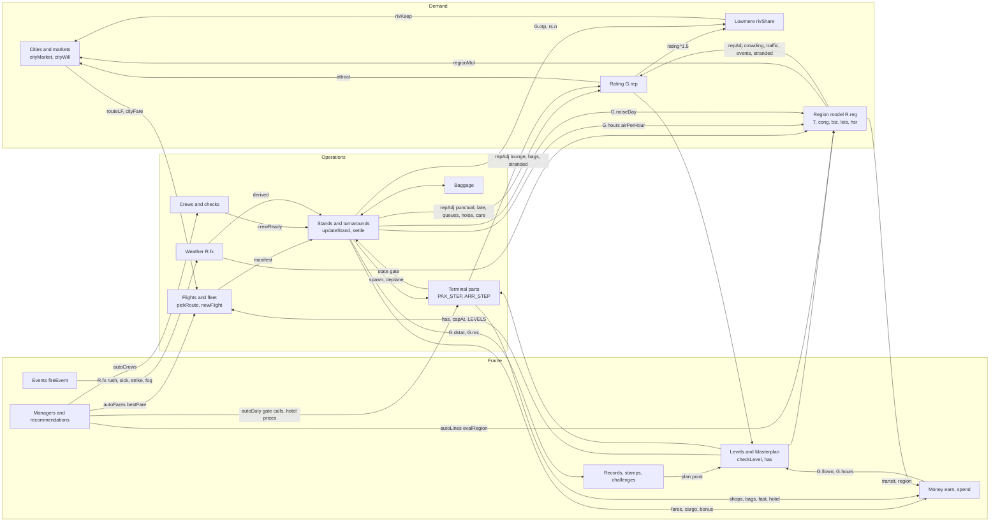

# Systems review: how the systems connect, and how to make choices interesting

Issue: #65 · Status: Proposed · PRs: (added as they open)

A plan, not a change to the game. The owner asked for the game's systems to work smoothly together and interact in meaningful ways, so that choices are interesting, and is open to refactoring the code and reworking systems to get there. Written 27 Sep 2026 from `main` at version 30 (after #49 and #53; brief: `docs/briefs/systems-review.md`). Three parts: how the systems connect today, design proposals that link them, and the refactors that make those possible, then a recommended order. Nothing here is built until the owner approves it on the issue.

## Evidence

- **The code**, by `src/game/<file>:<line>`, and `node tools/graph.mjs update`, `dayTick`, `checkLevel`, `managersTick` and `resetAll`.
- **The bot on `main`**, seeds 1–3, 1,150 game hours, keeping Classic (`build/bot-N.log`; every level `ok`, level 5 `near` on all three as the project notes expect; no errors):

| Seed | L1 | L3 | L5 | L7 | L9 | Cash floor after hour 150 | Cash at the end | Fleet at the end |
| --- | --- | --- | --- | --- | --- | --- | --- | --- |
| 1 | 40.3 | 104 | 327.2 | 638.8 | 1100 | $2,796 | $0.80M (after buying Lowmere) | 21 W-300, 2 F-200 |
| 2 | 35.5 | 102.3 | 335.7 | 653.6 | 1105.5 | $2,939 | $1.43M | 21 W-300, 2 F-200 |
| 3 | 36.6 | 99 | 319.5 | 632.4 | 1091.5 | $4,341 | $0.77M | 21 W-300, 2 F-200 |

  A small script over the six-hourly snapshots (the rating causes in `why`, the requirement furthest from met for the next level, the daily trend) gave the numbers quoted below; `docs/ideas/game-logic.md` has the same runs read a different way and this review builds on its findings rather than repeating them.
- **A play of `build/test.html`** with the bot's saves at levels 2, 5 and 9 (`build/saves/L<n>.json`), a few game hours each at 8× with frames drawn, reading every tab, the board, the advisor and the Masterplan, at 1440×900 and on a 390×844 phone.

## Part 1: How the systems connect today

### The map

What the diagram shows at a glance: everything flows into the rating and into money, and only three things flow out of the rating (`attract` at `03-state.js:67`, `rivShare` at `33-lowmere.js:99`, `levelChecks` at `09-construction-levels-days.js:54`). Money flows out only into purchases. The level gate (`has`, `capAt`, `LEVELS`) is the only thing that reaches every system, and it reaches them one way: unlocks. Nothing flows back from the terminal, the region or Lowmere into which routes the dispatcher picks, and nothing flows from the routes into how the terminal is used.

### The clocks

`update(dt)` (`11-main-update.js:2`) runs the stands, the landside and arrivals passes, the region every 5 game minutes and the money each step. On each new game minute one hard-coded line calls `updateBuilds`, `layoutTick`, `dayTick`, `checkLevel`, `fleetTick`, `managersTick` (every 360), `mgrStep`, `TERM_MINUTE`, `mgrHour` and `recordsHour` (every 60), `crewTick` (every 30), `nightChecks` (03:00) and the advertising penalty (`11-main-update.js:6`). `dayTick` (`09-construction-levels-days.js:77`) closes the day: the report, `G.days`, `G.otp`, then `recordsDay`, `regionDay`, `rivalDay`, `chalDay` and `TERM_DAY`. That one line and that one function are the whole schedule; every feature that needs a tick edits them (the terminal got a table, `TERM_MINUTE`, so it didn't have to).

### System by system

For each: what feeds it and what it feeds; which of the player's choices it responds to; where it runs on its own, where one choice always wins, and where it can be ignored at no cost.

**The airport: stands, runway, layouts** (`08-stands.js`, `07-passengers.js:94` runway, `39-layouts.js`).
- Fed by: the fleet (`allocFlight`, `05-flights.js:16`), `derived()` (`03-state.js:47`: upgrades, weather and the pay policy folded into one object of speeds), the layout tables `applyLayout` fills in place (`39-layouts.js:171`). Feeds: passengers to the terminal (`spawnParty`, `deplane`), the rating (`settle`, `08-stands.js:162`: punctual +2.5, late −1.5 to −8, queues ±, noise, care, arrivals), the money (fares, bonus, cargo, handling), `G.flown` and `G.dstat`, and Lowmere through `G.otp` and `rs.n`.
- Responds to: which stands are built and in what order (`STAND_ORDER`), boarding method and rear stairs, partner airlines on or off per stand, the layout, and every apron and gate upgrade through `derived()`.
- Runs on its own: `allocFlight` gives a stand to the readiest plane, or after 5 idle minutes a partner (`05-flights.js:21`); nothing is scheduled, so the board is a consequence, not a plan.
- One choice wins: the biggest plane that fits (`docs/ideas/game-logic.md` finding 5). The play at level 5 shows the board with five departures, all to New York; at level 9, four widebodies on Pier B and partners on the A gates flying the short-haul routes the player's planes abandoned.
- Ignorable: the boarding method past Steffen (a one-off purchase), the pay and repair policies, and every layout but Classic (the bot never rebuilds, and the baselines are for Classic).

**Flights and airlines: the fleet, the dispatcher, partners** (`05-flights.js`, `03-state.js:83`, `34-airline-operations.js`).
- Fed by: routes and their markets (`routeLF`, `cityFare`), fuel (`fuelMul`, `04-geometry.js:46`), crews (`crewReady`), wear (`faultRisk`). Feeds: manifests of typed passengers (`buildManifest`, `05-flights.js:27`: business share from the city, groups from `GROUP_CITIES`, families by season), inbound loads, transfers (18% of an inbound load moved to another stand's flight, `05-flights.js:80`), cargo.
- Responds to: which planes are bought and sold, the global fare `G.fare`, the curfew (`curfewSoon`, `05-flights.js:15`), the Maintenance policy, crews hired.
- Runs on its own: `pickRoute` (`03-state.js:83`) sends each plane where it earns most per hour, with a ±8% dice roll; `farDelay` (`34-airline-operations.js:217`); `pickPartner` picks any partner at random, so partners have no memory, no schedule and no reaction (`05-flights.js:9`).
- One choice wins: one route. At level 9 on seed 1, Singapore takes 24 of the player's 45 flights a day and 17 of 24 open routes fly zero flights (Office › Reports). The goal "Fly to 30 destinations" counts routes bought, not flown.
- Ignorable: crews (`autoCrews` on by default hires them, and the `Well rested` stamp is earned by the bot on day 10 with no choice made); partners (they come whenever a stand is idle, whatever the airport does).

**Passengers** (`05-flights.js:26` kinds, `07-passengers.js`, `42-terminal.js` tables).
- Fed by: the manifest (kind, party, bags, carry-on, priority, online check-in from `D.online`), the region's transit share (`pickTransit`, `26-region-network.js:129`), the car park. Feeds: every queue in the terminal, the shops, the gate lounges, the rating through `p.wait` at `settle` and `finishArrival`, `G.paxSeated`, `G.bizFlown`.
- Responds to: the terminal's upgrades (`derived()`), the walkway and mover, the layout's rooms (`route`, `walk`), fares (fewer passengers board faster), the bag fee.
- Runs on its own: kinds are drawn per flight from the city's business share and the season; nothing a passenger experiences comes back to the city they came from (`rsOf` decays seat counts and takings only, `03-state.js:66`).
- One choice wins: none; this is the game's richest system and the one whose choices show on the map.
- Ignorable: the kinds. Business, leisure, families, groups and those who need help differ in speed, bags and shopping (`PTYPE`, `05-flights.js:26`), but nothing in the airport is chosen by kind except the fast track and the assistance service.

**The terminal** (`42-terminal.js` to `47-hotel.js`).
- Fed by: passengers from the stands and the forecourt; `D` (desks, lanes, officers from the roster, `staffed`, `04-geometry.js:45`); `pol('gates')` and `autoDuty`; weather (`R.fx.strike` halves bag-drop staff, `43-departures.js:49`; storm and fog strand passengers into the hotel, `47-hotel.js:73`); `R.reg.wageMul` and `parkMul`. Feeds: `state='gate'` back to the stands (`gateQueue`, `08-stands.js:83`), `F.bagsIn` to the hold (`45-baggage.js:61`), shops and hotel money, the rating (`bags` −0.25 a bag, `lounge`, `stranded`), `G.hotelBook` to the advisor.
- Responds to: every Terminal, Sales and Airfield upgrade, the rosters (`G.open`, `G.auto`), the gate-call policy, hotel prices.
- Runs on its own: rostering (`R.autoN`, `11-main-update.js:5`) opens desks by queue length every 2 minutes; the duty manager calls gates and prices rooms; e-gate eligibility is a coin toss per passenger (`p.elig`, `05-flights.js:68`) whatever the origin.
- One choice wins: buy every upgrade in cost order. The bot does (`tools/bot.js:84`) and stays within the baselines; nothing in the terminal has a downside except its price.
- Ignorable: the gate-call policy (the duty manager overrides it), the family lane and search tables (their costs are wages the player never notices), the hotel (rooms fill from arrivals and crews without a choice).

**The region and transport** (`24-region-places.js` to `30-region-ui.js`).
- Fed by: the airport's flyers per hour (`airPerHour` reads `G.hours`, `26-region-network.js:2`), built gates and level as airport jobs (`26-region-network.js:9`), noise (`G.noiseDay`, drained daily into smaller town targets, `26-region-network.js:141`), the lines and development sites the player builds. Feeds: `regionMul` into every city's market and willingness (`03-state.js:69`: `(1+T)·(1−0.12·cong)·(1+surge)·(1+biz·C.biz+leis·(1−C.biz))`, ×0.85 short-haul and ×1.12 long-haul with high-speed rail), the transit share of passengers, `parkMul`, `wageMul` (up to −12%), `jobs` into cargo fill, transit and region money (`regionMoney`, `26-region-network.js:124`), and rating through `crowding`, `traffic`, `events` and `stranded`.
- Responds to: lines (mode, stops, frequency, fare, night, sync), station upgrades, development sites, the replacement-bus policy, noise insulation, the ring road.
- Runs on its own: towns grow daily whether or not there are lines; the transport manager reviews every line every six hours and adds services to overfull ones (`32-managers.js:17, 32`); events fire from built venues and settle themselves (`27-region-events-lines.js:12`); weather cells drift over the airport (`28-region-weather.js:12`).
- One choice wins: premium fares on nearly every line (roadmap, "Fares that riders notice"); and every development site, since the bot builds all of them in a fixed list (`tools/bot.js:77`).
- Ignorable: with no lines at all, `share`, `T`, `hsr` and `wageMul` sit at zero or one and the airport still fills its flights from `attract` alone. The region is a bonus, never a constraint. At level 9 the manager runs four bus lines at one service an hour carrying nobody (play, Region tab) because closing is a suggestion it makes and never takes.

**Routes and the world** (`31-routes.js`; `pickRoute`, `cityMarket`, `cityWill`, `routeLF`, `bestFare` in `03-state.js:58-89`).
- Fed by: the rating (`attract`), the region (`regionMul`), Lowmere (`rivKeep`), the season, marketing, promotions, fares. Feeds: how full each flight is (`routeLF`), what it pays (`cityFare`), and so where every plane goes.
- Responds to: which routes are opened (a fee, `ROUTE_FEE`), each route's fare (−20%, standard, +25%), promotions, the global fare, the frequent flyer club.
- Runs on its own: `autoFares` (on by default) nudges each route to `bestFare` every six hours (`32-managers.js:21`); the dispatcher never looks at the network, only at each plane's best trip now.
- One choice wins: open every route (a fee, and a goal rewards it); then the dispatcher concentrates on the one or two biggest markets. A route's market never shrinks from being ignored, so there is no cost to leaving 17 routes unflown.
- Ignorable: fares (the manager sets them), promotions (the bot never buys one, and it stays within the baselines).

**Lowmere and rivals** (`33-lowmere.js`).
- Fed by: your flights a day, fare, rating and on-time rate per shared route (`rivShare`, `33-lowmere.js:96`), promotions, slot agreements, high-speed rail. Feeds: `rivKeep` into every shared route's market (`03-state.js:71`), the `share` record and two stamps, the Records challenge, the day-end goal, and a dividend once bought (`33-lowmere.js:116`).
- Responds to: fares, frequency, punctuality, rating, the Slot agreements plan, high-speed rail, and buying it at level 8.
- Runs on its own: it grows with your level (`V.lv`, `33-lowmere.js:125`), picks routes where your flights are full, sells for three days now and then, and backs off where you win four days running.
- One choice wins: buy it. Every seed does at level 8. With the rating pinned at 100 against Lowmere's at most 72, `rivShare` never falls far enough to matter (52–64% at the end, `docs/ideas/game-logic.md` finding 6).
- Ignorable: yes, completely: nothing it does reaches the terminal, the stands or the region, and losing share on a route sends that plane to another route.

**Managers and recommendations** (`32-managers.js`, `16-advisor.js`, `34-airline-operations.js:211`, `46-market.js:26`, `47-hotel.js:93`).
- Four managers, four settings, and none knows about the others: the transport manager values a line change by transit profit, the airport's extra demand (`airWorth`) and wages (`recValue`, `32-managers.js:52`); the route manager values only a route's own fare (`bestFare`); the fleet manager keeps crews at 1.3 per plane; the duty manager calls gates by walk time and prices rooms by last night. The advisor (`advise`, `16-advisor.js:2`) is a list of 27 rules in fixed priority, each reading one system; Lowmere, the weather, policies and the records have no rule at all.
- Responds to: the settings, `L.man` and `r.man` (a line or route the player has taken over is left alone).
- Runs on its own: yes, by design (`docs/decisions/ADR-2026-09-26-managers-decide-by-value.md`). The transport manager is the only one that measures anything against the rest of the game.
- One choice wins: leave them all on. The bot does, and reaches every baseline.

**Levels and the Masterplan** (`01-constants.js:78`, `02-masterplan.js`, `09-construction-levels-days.js:53`).
- Fed by: `G.flown`, `dailyPax()`, `G.rep`, `gatesOpen()`. Feeds: plan points, `has()` gates for 62 plans in 6 branches, `capAt` caps on every upgrade, stand and pier levels, tab openings, the level-up card.
- Responds to: which plans are approved, in what order, and consultants bought from level 4.
- Runs on its own: `curGoal` walks a fixed list (`GOALS`, `02-masterplan.js:83`); levels check four counts.
- One choice wins: from level 4, passengers flown is the requirement furthest from met in about four snapshots in five (136 of 166 six-hourly snapshots from level 4 up on seed 1, and the same shape on seeds 2 and 3); gates are the rest, while Pier B's stands are bought at levels 4–6; the rating requirement never binds. Plan points run out: at the end 53 of 62 plans approved with 1 point left, every non-layout plan taken.
- Ignorable: the branches. There is no cost to approving everything, so the Masterplan is a queue, not a choice; the Layouts branch is the only one the bot skips, and it is the only one with a real trade-off.

**Money** (`earn`, `spend`, `05-flights.js:118`; `upkeepRate`, `03-state.js:96`; `regionMoney`; the loan).
- Fed by: fares (17%), arrivals (9%), cargo (14%), shops (21%), on-time bonus (13%), transit (12%), bags, landside, priority, handling (seed 1's `revBy` at the end, $35M in). Costs are 16% of income over the run (`docs/ideas/game-logic.md` finding 4). Feeds: purchases and nothing else.
- Responds to: everything the player buys; fares; the loan; the pay policy.
- Runs on its own: wages, upkeep and interest tick every step (`11-main-update.js:9-12`).
- One choice wins: spend it. There is no upkeep that grows with traffic, no landing charge, no per-passenger cost; a big airport's costs are a flat rate plus buildings, so cash climbs to $0.8–2.9M with nothing left to buy.
- Ignorable: the loan (never needed), and the Money tab.

**Events** (`fireEvent`, `10-events-toasts.js:153`; `regionEvent`, `28-region-weather.js:31`; weather cells).
- Fed by: the pay policy (low pay adds sick days and strikes), the number of lanes, the season. Feeds: `R.fx` flags read by `derived()`, the runway (storm closes it, `07-passengers.js:99`), the terminal and the hotel.
- Responds to: the pay, agency and replacement-bus policies, ILS, de-icing, radar, the operations centre.
- Runs on its own: every 55–125 game minutes (`11-main-update.js:7`), a rush, a sick day, a strike, or a line fault. Weather lives in three places that don't know each other: `fireEvent` can set `R.fx.fog` and `R.fx.snow` (`10-events-toasts.js:158`), `updateWeather`'s cells set the same flags plus storm and rain (`28-region-weather.js:15`), and `farDelay` rolls its own weather at the far end (`34-airline-operations.js:217`).
- One choice wins: Good pay (no strikes, faster staff) once cash allows; the rest are flags with no decision.
- Ignorable: yes. Nothing asks the player to respond; the only toasts with choices are the tour, Lowmere's opening and the What's new card. The rush (`R.fx.rush`) is a gift: +15% attraction and +30% arrivals.

**Records, stamps and challenges** (`35-records.js`).
- Fed by: `G.dstat`, `G.bestStreak`, routes, riders, the Lowmere share. Feeds: cash (12% of a day's profit per challenge) and one plan point a week for all three, until the plans run out.
- Responds to: nothing directly; challenges are sized from last week's pace at 112% (`chalDay`, `35-records.js:247`).
- Runs on its own and can be ignored (the setting `chal` turns them off). The bot finishes 1–4 full sets in seven weeks (`docs/ideas/game-logic.md` finding 8).

### What the play showed that the bot can't

- **The board is the tell.** At level 5, five flights to New York; at level 9, partners fly Amsterdam, Lisbon, Budapest and Tenerife while every one of the player's own planes flies Singapore. A player sees at once that the network is a fiction.
- **The rating explains itself, but only in text.** Office › Plan lists the last three hours' causes (`repRecent`), and the advisor names the worst one over −5. Nothing on the map points at where a cause happened; `lounge` (`46-market.js:53`), `bus` (`08-stands.js:16`) and `layout` (`39-layouts.js:197`) have no entry in `REPWHY` at all, so they are counted but never named.
- **Region news is noise.** Eight lines of "a signal failure stopped R1" for a line carrying 9 riders an hour. The manager knows the line is worthless (it suggests closing it) and keeps running it.
- **Recommendations are right and idle.** "Defend Prague: cut the fare" sits beside "Auto fares ✓", which has already priced Prague; the two managers disagree and the player is asked to break the tie.
- **The Masterplan at level 5 has 5 points unspent and 19 plans ready**, and nothing to say which matters. The level-up card does this well for what a level unlocks; nothing does it for what a plan would change.
- **Nothing is ever refused.** No build is blocked by a neighbour, a regulator or a partner, no flight is cancelled, no route is lost, no level is lost. The only "no" in the game is a price.

### Where the connections are thin: a summary

| Link | Exists? | Where | What's missing |
| --- | --- | --- | --- |
| Rating → demand, share, levels | Yes | `attract`, `rivShare`, `levelChecks` | It is pinned at 91–100 from hour 24, so none of the three ever moves (#57 idea 1) |
| Routes → terminal | No | `p.elig`, `PTYPE` are drawn without the origin | A long-haul arrival looks like a Dublin one at passports |
| Region → terminal | Thin | `pickTransit`, `parkMul` | Who comes from where changes only how they arrive, not who they are |
| Terminal → routes, Lowmere | No | | A bad day at security costs rating, which costs nothing |
| Lowmere → stands, partners, region | No | | Lowmere is a number on the world map |
| Time of day → dispatcher, terminal, lines | Thin | `demandNow` only in `cityWill` | No banks, no peaks felt, timetables flat |
| Weather → one story | No | `fireEvent`, `updateWeather`, `farDelay` | Three weathers |
| Money → anything but purchases | No | | Costs are 16% of income and flat |
| Managers → each other | No | four settings, four value models | The route manager cannot see the region; the advisor cannot see Lowmere |
| Player → "why" | Text | `repRecent`, reports, news | No cause is shown where it happened |

## Part 2: Design: making choices interesting

Ten proposals. Each links systems so that a choice in one shows up in others, in the owner's way: on the map, the board and the gates, never as a text event; hidden until unlocked; a manager for players who'd rather not. They build on `docs/ideas/game-logic.md` (#57), the September board (`docs/ideas/board-2026-09.md`) and the owner's bundles, and say which bundle each belongs in. Not proposed again: anything the owner parked or rejected (a mix of planes that pays, costs that grow with the airport, holding your level, a ground crew for the whole apron, disruption days, night flights that pay for their noise, seasons), and #57's liked ideas, which stand on their own; where a proposal is the groundwork for one of them it says so. Sizes: **small** one session, **medium** a spec, **large** a bundle. Sim cost is against `perf` on `main` (late game about 0.15× on the machine that measured #49, budget 0.25×).

### 1. A network you have to keep

- **Trade-off.** Every open route wants a service. A route flown less than its market wants (`rsOf(c).s` against `cityMarket`) goes quiet: its market shrinks a few percent a day towards what you fly, Lowmere moves in on it first (it already prefers routes where your load is high, `33-lowmere.js:127`; add routes you don't fly), and a partner may take it over for its cut. A route flown often wins back travellers (a frequency term in `cityWill` for business cities, the one piece of #57 idea 5 that isn't about plane size). So the player chooses between a few fat routes with widebodies and a network kept alive with smaller planes and partners, and the dispatcher, which follows money, spreads planes by itself once frequency pays.
- **What they'd see.** The world map's route lines thin and grey as a route goes quiet, and Lowmere's dashed line appears over it; the board shows a partner's code on a route you dropped; the Routes tab's card says "Lowmere flies here 3× a day, you 0×". No toast.
- **Ties.** Routes, the dispatcher, Lowmere, partners, the goals ("Fly to 30 destinations" starts to mean 30 flown).
- **Managers.** The route manager gains a second lever beside fares: it can mark a route "keep" (a minimum frequency the dispatcher honours) or "let go". The recommendations say which routes are slipping.
- **Risk.** Medium to the baselines: the bot's fleet buying (`tools/bot.js:36`) buys the best type only and would leave routes to decay; it needs to learn to keep two types. None to old saves (market decay starts from today's `rs`).
- **Sim cost.** None (daily).
- **Size.** Medium. **Before the bundles**: it's the fix for finding 5 without touching plane sizes, and it makes #57 idea 8 (Lowmere fights back) bite where it should. Needs refactor step 2 (routes in one file).

### 2. Routes shape the terminal

- **Trade-off.** Who arrives depends on where from. Passport mix by origin: domestic flights already skip immigration (`DOMESTIC`, `44-arrivals.js:7`); short-haul Europe is 80% e-gate eligible, long-haul 40%, ultra long-haul 25%, and customs stops 1 in 20 off long-haul instead of 1 in 40. Departing, business cities bring online check-in and carry-ons; sun routes bring families with two bags each and groups (already partly in `buildManifest`, `05-flights.js:28`). So opening Mumbai is a decision about passport desks, and opening Tenerife is a decision about bag drop and the family lane. The income from a long-haul route now has a cost in the arrivals hall, which is where the level 7–9 stretch should be spent.
- **What they'd see.** A widebody lands and the passport queue on the map grows while the e-gates stand idle; the Terminal › Arrivals card names the flight; a sun route's check-in islands fill with families. The Routes tab's card gains one line: "Arrivals: mostly passport desks" or "mostly e-gates".
- **Ties.** Routes, arrivals, departures, baggage, the rostering system, upgrades.
- **Managers.** Rostering already opens desks and lanes by queue; the duty manager gains "open passport desks before a long-haul lands" (it knows `F.arr.sta`). The advisor's arrivals rule names the route.
- **Risk.** Low to the baselines: the bot buys every arrivals upgrade anyway; expect queues to lengthen a little at level 7+ and the `arrivals` rating cause to move. None to old saves (no new fields: `p.elig` and `p.checked` are drawn at `newFlight`).
- **Sim cost.** None.
- **Size.** Small. **Before bundle 4**, and its groundwork: kinds of passenger with a cause.

### 3. Where flyers come from decides who they are

- **Trade-off.** The region's places carry a mix: the business park and the university send work travellers and students, the estates send families, the marina and the old town send tourists, a match sends a crowd of groups. Today the region only changes how a passenger arrives (`pickTransit`) and how many there are (`regionMul`). Make it also change *who*: `buildManifest` draws each party's kind from the origin place's mix as well as the city's. So a rail line from the business park brings the kiosks and the fast track work, and a stadium brings groups that swamp check-in at 18:00 (the board's "Big groups", 11, arrives for free). The player chooses which places to grow and which to connect, and the terminal shows the consequence.
- **What they'd see.** The crowd on the map changes colour with the line that brought it; a match day fills the check-in hall with one colour; the region map's place cards show their mix.
- **Ties.** Region development sites, lines, the manifest, every terminal part, shops (groups gather at the bar, families at the play area).
- **Managers.** Nothing new to manage; the transport manager's value of a line already counts the airport's demand and would count the kinds' spend if `airWorth` read shop takings per kind.
- **Risk.** Medium to the baselines: shop takings and queue times move with the mix. None to old saves.
- **Sim cost.** Small (one lookup per party at `newFlight`).
- **Size.** Medium. **Bundle 4**, its first spec: it gives "passengers with a voice" a reason to differ before they review anything.

### 4. Banks and waves

- **Trade-off.** Time of day exists only as `demandNow` in a fare formula (`04-geometry.js:55`). Give it teeth: each route wants departures in windows (business cities at 07:00 and 18:00, sun routes mid-morning, long-haul overnight), the dispatcher scores a departure by when it lands as well as where, and the terminal, the runway and the lines feel the banks. The player chooses to bank (transfers connect, fares are better, the security hall spikes and the runway queues, so staffing and ATC pay) or to smooth (calm halls, emptier planes). Bundle 6's waves, and the roadmap's "Timetables by time of day" for lines, as one rule.
- **What they'd see.** The board fills in bursts; the security queue on the map swells at 06:30; the runway's holding line grows (the board's idea 7); trains run every 10 minutes at the peak and every 30 at noon.
- **Ties.** Routes, the dispatcher, stands, the runway, departures, the region's lines and the transport manager, transfers (proposal 5).
- **Managers.** The duty manager rosters for the wave (it can see the board); the transport manager's `evalRegion` already measures at 09:00 and 17:30 and would measure at the banks instead.
- **Risk.** High to the baselines (on-time and queues move at peaks). None to old saves (`rs` gains an hour histogram with a default).
- **Sim cost.** None in the simulation; the dispatcher's score gains a term.
- **Size.** Large. **Bundle 6**, its first part; proposal 5 needs it.

### 5. The hub: connections you can see

- **Trade-off.** Transfers exist (`connect`, `08-stands.js:126`; 18% of an inbound load, `05-flights.js:80`; transfer bags, `A.xb`) but no one chooses them. Make them a market: two routes you fly through the same bank create a transfer flow (a share of the smaller market), which Lowmere can't compete for and which pays a fare and a half. A missed connection (a late inbound, a tight bank, a long walk between piers in the layout) shows at a transfer desk airside (the board's parked "Missed connections you can see", which the owner parked as a feature but which here is the cost side of a choice) and costs a rebooking and rating. The player chooses which routes to join and how tight to bank them, and the layout matters (`LAY.xfer`, `39-layouts.js`; the Satellite's train).
- **What they'd see.** On the world map, joined routes draw as one arc through home; on the airport map, transfer passengers walk pier to pier and queue at a transfer desk when they miss; the board shows CONNECTING 12 on a held flight.
- **Ties.** Routes, the dispatcher, stands, the layout's walks, baggage transfer, Lowmere, the hotel (long connections stay), the connections policy (`pol('xfer')`, which finally has something to decide).
- **Managers.** The route manager pairs routes for the player; the duty manager holds or releases a flight by the value of the connecting passengers against the delay.
- **Risk.** High to the baselines (a new income; long-haul fills differently). None to old saves.
- **Sim cost.** Small (transfers already exist; a market term at `newFlight`).
- **Size.** Large. **Bundle 6**, after proposal 4.

### 6. Slots: a stand's day shared by airlines

- **Trade-off.** Today a stand takes whatever is ready (`allocFlight`) and a partner after five idle minutes. Give each stand a day of slots that your planes, partners and, later, charters (board 10) hold; partners hold theirs by habit and lose them if their turnarounds go badly, and give them up when Lowmere poaches them (board 18). A slot held by a partner is a stand you can't use at that hour; a slot you take back is a partner lost. The player chooses which airlines to keep at which gates. This is the mechanism under #57 idea 2 (airlines that choose you): the idea gives partners a mood, this gives them a place to have it.
- **What they'd see.** The gate card shows the day's slots as a strip; a partner's tail colour on its slot; an empty slot where a partner left; the board shows the partner's next flight before its plane arrives.
- **Ties.** Stands, partners, Lowmere, the alliance plan, the level (`Gates open`), charters and big groups.
- **Managers.** The duty manager fills empty slots with partners at the alliance's terms; "Partner airlines ✓" per stand becomes "Partners may hold slots here".
- **Risk.** Medium: partners are $0.6M of $35M but keep stands busy early. Old saves: `G.stands[i].slots` defaults to today's behaviour (any partner, any time).
- **Sim cost.** None (a table per stand read at `allocFlight`).
- **Size.** Medium. **Bundle 5**, before #57 idea 2 and board 18.

### 7. Good neighbours: planning permission

- **Trade-off.** Noise already shrinks towns (`regionDay`, `26-region-network.js:141`) and costs rating, silently. Make the towns answer: each town has a mood from noise, jobs (airport jobs already grow with gates and level, `26-region-network.js:9`), access (`reg.acc`) and traffic. A big build (Pier B, the second runway, a rebuild into a bigger layout, a landmark) needs planning permission, which the nearest towns grant at once when happy and delay by days when not; a curfew, insulation, a line to their station or a ring road wins them back. So night flights are worth their cargo rates only if you can afford the wait on the runway, and the region is a constraint at last. Not #57 idea 10 (rejected): nothing pays more at night; the choice is what the noise costs you in permission.
- **What they'd see.** A town's mood on the region map (a colour on its name); a build site with a "planning" hatch before the crane arrives; the noise rings already drawn (`29-region-map.js:109`) now matter.
- **Ties.** Region, construction, the curfew policy, insulation, lines, levels (gates open), layouts.
- **Managers.** The transport manager already values lines by the airport's demand; add the towns' mood to `recValue` so it suggests the line that unblocks the runway. The advisor's `noise` rule points at the town.
- **Risk.** Medium to the baselines: the bot builds Pier B and the second runway on time today; a delay of a day or two at level 4 moves level 5 (already `near`). Tune the delay so an airport with a curfew or insulation sees none. Old saves: a mood field per town with a default of content.
- **Sim cost.** None (daily).
- **Size.** Medium. **Bundle 5**: the "stakes" the owner asked for, without bankruptcy.

### 8. One weather

- **Trade-off.** Three weathers become one: the region's cells (`28-region-weather.js`) are the weather; `fireEvent` stops setting fog and snow; `farDelay` reads the destination's season and a rolled far-end weather that the board can show; the forecast the board already shows (`wxForecast`) covers the far end too. Then the choices already in the game line up along one storm: radar and ILS at home, the operations centre at the far end, de-icing pads, replacement buses on the lines, the hotel for stranded passengers, and the curfew. The trade-off is which end of the storm to spend on.
- **What they'd see.** One storm crossing the region map, the airport map (the weather part, #61) and the world map (a cloud over Dubai, a plane late on the arc); the board's DELAYED reasons agree with the sky.
- **Ties.** Weather, events, the runway, the lines, airline operations, the hotel, the board.
- **Managers.** Nothing to manage; the advisor's weather tips point at the right end.
- **Risk.** Low to medium to the baselines: fog and snow from `fireEvent` today come oftener than the cells bring them; keep the total the same. None to old saves.
- **Sim cost.** None.
- **Size.** Small to medium. **Before the bundles**, in the same session as the real airport's weather part is brought together (#61 draws what the cells do; this makes the cells the only source). Needs refactor step 8.

### 9. Why did that change: one ledger, shown where it happened

- **Trade-off.** None for the player; this is the piece that lets every other proposal show rather than tell. Every effect between systems (rating causes, demand terms, money by kind, share) is recorded with a cause and a place, and the rating chip, the cash chip and the on-time chip open a short list of today's causes, each of which flies the camera to where it happened (the gate, the line, the route). The board's idea 30, and the groundwork for bundle 4's heat map and for #57 idea 1 (a rating that reflects the last day needs its causes readable).
- **What they'd see.** Tap the rating: "Late departures −13 at A3, B1" and the camera goes to A3; tap cash: "Shops $7.4k, cargo $4.9k, on-time bonus $4.4k"; a small mark on the map where a cause was recorded in the last hour (a red ring at a crowded lounge, a grey one at a stranded stop).
- **Ties.** Everything that calls `repAdj`, `earn` or `spend`; the advisor and the recommendations read the same ledger instead of their own rules.
- **Managers.** The advisor becomes the top of the ledger, so it always explains the biggest cause, and every cause gets a fix pointer (today `lounge`, `bus` and `layout` have none).
- **Risk.** None to the baselines (drawing and UI on top of refactor step 3). None to old saves (runtime only).
- **Sim cost.** None; the ledger replaces `R.repEv`, which already keeps three hours of events.
- **Size.** Small to medium. **Before the bundles**, right after refactor step 3.

### 10. Managers that trade across systems

- **Trade-off.** Today four managers with four settings and four ideas of value. Give them one: `worth(change)` in money an hour, as the transport manager already measures it (`recValue`), so the route manager values a fare cut by the transit riders it brings, the duty manager values holding a flight by the connecting passengers and the region's stranded riders, and one general manager setting runs all four at once for players who want none of the detail (the existing four stay for players who want to take one back). The player's choice becomes which manager to overrule, and the recommendations stop contradicting each other ("Defend Prague: cut the fare" beside "Auto fares ✓").
- **What they'd see.** One "Managers" card in the Office with the last three decisions of each, each pointing at the map. Fewer, better recommendations.
- **Ties.** Managers, routes, region, crews, the terminal, Lowmere (the route manager's fare decision counts the share it wins).
- **Managers.** This is the managers.
- **Risk.** Low to the baselines if the general manager reproduces today's decisions first (a pure refactor of the four, then new levers). None to old saves (a new setting, `PLAY` ignores settings).
- **Sim cost.** The transport manager's measurements already run one a minute; the others are cheap.
- **Size.** Medium. **Before bundle 5**, since 6 and 7 add levers a general manager must handle.

### How the proposals fit the bundles

| Order | Proposal | Bundle | Builds on |
| --- | --- | --- | --- |
| 1 | 9 One ledger | before the bundles | board 30; groundwork for #57 idea 1 and bundle 4 |
| 2 | 8 One weather | before the bundles, with #61's bring-together | real airport weather |
| 3 | 2 Routes shape the terminal | before bundle 4 | terminal spec's numbers |
| 4 | 1 A network you have to keep | before the bundles | #57 ideas 5 (its frequency rule only) and 8 |
| 5 | #57 idea 1, a rating that reflects the last day | before the bundles | proposal 9 |
| 6 | 10 Managers that trade | before bundle 5 | ADR managers-decide-by-value |
| 7 | 3 Where flyers come from | bundle 4 | board 11, #57 idea 4 |
| 8 | 6 Slots | bundle 5 | #57 idea 2, board 10 and 18 |
| 9 | 7 Good neighbours | bundle 5 | region noise |
| 10 | 4 Banks and waves | bundle 6 | roadmap timetables, board 7 |
| 11 | 5 The hub | bundle 6 | proposal 4 |

## Part 3: Code: refactors that make that possible

Ranked steps, each small enough for one session and one PR, each a pure refactor: `PLAY` identical on seeds 1–3 against a build of `main`, `npm run check` green, and the checks named written first, in the same PR, so they fail on `main` for the right reason where they can. The order weighs what each unblocks against how it fits round the work already planned: the real airport's bring-together PR (touches `12-drawing.js`, `50-scene.js` and the parts' files), then "The terminal as a place" (#49: a checks-first PR, then groundwork in `39`, `41`–`47`, `50`, then five parts in new files `56`–`60`).

### Step 1. Live getters through the sim hook (`tools/build.mjs`)

- **What.** `Object.assign(window.__sim,SIMX)` (`tools/build.mjs:43`) copies the *value* of every getter in `SIMX`, so `get AF_Y(){return AF_Y}` (`50-scene.js:34`) and `get ROOF(){return ROOF}` (`53-roofs.js:53`) read 0 and null forever. Use `Object.defineProperties(window.__sim,Object.getOwnPropertyDescriptors(SIMX))`, and have the build reject a `let` exposed through `SIMX` without a getter.
- **Check first.** `rules`: `__sim.AF_Y` equals `LAY.top` after `applyLayout('mid')`, and `__sim.ROOF` is not null after a frame. Fails on `main`.
- **Unblocks.** The terminal-place checks-first PR (its checks read `roofA`, `R.floor` and the layout's rooms through the hook); every check on layouts.
- **Fits.** Now; a one-hour session; nothing else touches `build.mjs`.

### Step 2. Routes and demand in one file

- **What.** Move the demand and dispatcher functions out of `03-state.js:58-94` (`rsOf`, `attract`, `fareEl`, `regionMul`, `cityMarket`, `cityWill`, `fareSplit`, `paxLF`, `cityFare`, `routeLF`, `bestFare`, `loadFactor`, `routeOp`, `pickRoute`, `openRoute`, `promoteRoute`, `arrivalRate`) into `31-routes.js`, leaving `03-state.js` as state and helpers. The build's duplicate-name check and the joined scope make this a cut and paste; `graph.mjs` then answers "routes" with one file.
- **Check first.** None new: `rules` (fares fill more seats, Lowmere share rises with fares) and `PLAY` identical. Add a `graph` warning when a function named in a `docs/SYSTEMS.md` section lives outside that section's files, which is what would have flagged this.
- **Unblocks.** Proposals 1 and 5 (the dispatcher and the market in one place), #57 ideas 5 and 8.
- **Fits.** Now. Conflicts with nothing open (#61 adds a drawing file; #54 and #63 touch the shell and roofs).

### Step 3. One effects ledger

- **What.** A new effects file, numbered `04` so it comes before the systems that call it, holding `repAdj`, `earn`, `spend`, `floater`'s cause plumbing, `REPWHY`/`REPLBL` and `repRecent` (from `05-flights.js:112-121`), with one entry point `effect(kind, cause, amount, at)` where `at` is a map place (a stand index, a hall, a line, a route). Every call keeps its numbers; the new argument is the place, filled in where it's known (`settle` knows its stand, `leaveBags` its flight, the region its line). `REPWHY` gains the three missing causes (`lounge`, `bus`, `layout`) and a check that every cause used has a label and a pointer.
- **Check first.** `rules`: every `why` key passed to `repAdj` over a bot day has a `REPWHY` entry (fails on `main`: `lounge`, `bus`, `layout`); the sum of `R.repWhy` equals the change in `G.rep` over a seeded hour (a guard). `PLAY` identical.
- **Unblocks.** Proposal 9 directly, #57 idea 1 (one place to change what a rating event does), proposals 7 and 10 (their values read the ledger), bundle 4's heat map.
- **Fits.** Now. Touches `05`, `08`, `26`–`28`, `39`, `45`–`47` at call sites only (one added argument); the terminal-place parts don't edit those lines.

### Step 4. Hook tables for the clocks

- **What.** Replace the per-minute line in `update()` (`11-main-update.js:6`) and the tail of `dayTick` (`09-construction-levels-days.js:87`) with tables a system registers into from its own file: `MINUTE`, `HOUR`, `DAY` and `NIGHT` (03:00), each an ordered list of `{id, every, at, fn}`, with `TERM_MINUTE` and `TERM_DAY` folded in as entries. Order is data, listed once, and the check below pins it.
- **Check first.** `rules`: the order and cadence of the hooks over a seeded day matches a recorded list (`updateBuilds, layoutTick, dayTick, checkLevel, fleetTick, managersTick@360, mgrStep, TERM_MINUTE…, mgrHour@60, crewTick@30, recordsHour@60, nightChecks@1440+180, ads@60` and `recordsDay, regionDay, rivalDay, chalDay, TERM_DAY`); the recording is made on `main` in the same PR. `PLAY` identical proves the order held.
- **Unblocks.** Every proposal that adds a tick (1, 4, 6, 7, 10) without another edit to `update()`; `graph.mjs` can list hooks per system as it does the terminal's.
- **Fits.** Now or after step 3. The terminal-place groundwork registers into `TERM_MINUTE`; keep that name as an alias so its parts' briefs stay true.

### Step 5. Save migration as a table

- **What.** `resetAll` (`22-save.js:19`) is one function of defaults and eleven inline migrations keyed on the absence of a field (`state.level==null`, `!state.pv`, `!state.tour`, `!state.stamps`, `!state.crews`, `!state.routes`, `!state.gdone`, `G.seen==null`, `G.lounges==null`, `hadMgr`, `autoCrews`). Split it: a `FIELDS` table of defaults (extending `TERM_FIELDS` to the whole of `G`, so `DEFAULT()` and the defaults on load are one list), and `MIGRATIONS`, an ordered list of `{when: state=>bool, up: state=>void, note}` run in order, then the runtime reset. Same effect, one place to add the next field, and a list the `saves` check can walk.
- **Check first.** `saves` already loads every fixture; add a golden file: `JSON.stringify(G)` after `resetAll` of each `tools/saves/*.json` (with `savedAt` zeroed) hashed and recorded on `main`, and equal after the change. Also that every key of `DEFAULT()` is in `FIELDS` (fails on `main` until written).
- **Unblocks.** Every proposal adds saved state (1, 3, 4, 5, 6, 7 each add a field); the risk the brief names.
- **Fits.** Any time; `22-save.js` is touched by nothing planned.

### Step 6. Day stats as a registry

- **What.** `G.dstat` gains fields ad hoc wherever a day fact is first needed (`full`, `night`, `snowOT`, `crewDl`, `checks` in `08-stands.js:174`, `34-airline-operations.js:205, 223`) and `recordsDay` reads them by name. A `DAY_STATS` table of `{key, label, add(kind)}` that `dayTick` resets and `recordsDay`, the day report and the reports tab read.
- **Check first.** `rules`: the day report's fields after a bot day equal the recorded set. `PLAY` identical.
- **Unblocks.** #57 idea 3 (levels that ask for a day's on-time or share), #57 idea 1 (a day's net score), proposal 9.
- **Fits.** With step 4 or after it.

### Step 7. One pass over passengers

- **What.** Each step runs three full passes over `R.pax` (`11-main-update.js:19` movement and cull, `07-passengers.js:49` `PAX_STEP`, `08-stands.js:147` `ARR_STEP`), plus `gateQueue` gathered once per step (`08-stands.js:83`) and `occ()` in the market (`46-market.js:85`), and `updateMeeters` when not headless. Merge the three into one dispatch on `p.state` in the order they run today (landside, arrivals, then movement), and build the per-state index (`R.byState`) in that same pass so `gateQueue` and `occ()` read it. Do it in two PRs: first the index and the readers, then the merged pass, each with `PLAY` identical.
- **Check first.** `perf` already times it: record `main`'s ratio in the PR, and expect a fall. A `rules` guard that the sequence of a passenger's states over a seeded hour is unchanged (`PLAY` covers it; the guard names the first passenger that differs when it isn't).
- **Unblocks.** Headroom for proposals 3, 4 and 5 (more passengers at the peak) and for the terminal-place's watchers; the roadmap's "Speed on throttled phones".
- **Fits.** After the terminal-place groundwork and before its parts, or after they merge: it touches the loops the parts register into, not the parts, but running it while five parts are open is a merge risk for nothing.

### Step 8. Weather in one place

- **What.** `R.fx` is set from `fireEvent` (`10-events-toasts.js:158`), `updateWeather` (`28-region-weather.js:15`) and `regionEvent`, and read in 16 files. Move the setters behind one `wx.set(kind, until)` and the reads behind `wx.on(kind)` in `28-region-weather.js`, with `fireEvent` still rolling the same dice in the same order (so `PLAY` holds). No change to what happens; one file to read when proposal 8 makes the cells the only source.
- **Check first.** `rules`: the set of `R.fx` flags over a seeded day is unchanged (recorded on `main`). `PLAY` identical.
- **Unblocks.** Proposal 8; the advisor's weather rules.
- **Fits.** After #61 (weather you can see) merges, since it reads `R.fx` for drawing.

### Step 9. `12-drawing.js` after the parts

- **What.** Every function in `12-drawing.js` still runs straight from `draw()` (`12-drawing.js:177-223`), with `layer()` calls between them so the parts can add to a band; the inline blocks in `draw()` (signs and wait times, the ads banner, rain and strike effects, floaters) belong to the terminal, policies, weather and effects. Register each as a `LAYER` entry from its own file (`drawTerminal` and the signs from `42-terminal.js`, `drawLandside` from `07-passengers.js` or a landside file, floaters from the effects file of step 3, weather from `28`/`54`), until `draw()` is `sceneView` plus the layer loop, and `12-drawing.js` keeps the helpers and the stand drawing.
- **Check first.** `scene` already proves the layers draw once in order and that drawing never changes the game; add that `draw()` calls nothing but layers (a spy on the layer loop against a list of the functions that ran).
- **Unblocks.** The terminal-place groundwork's "one floor at a time" and "nothing under a solid roof", which need the terminal's drawing to be a layer it can gate; the real airport's parts already push layers.
- **Fits.** After the real airport's bring-together PR (which is the last to edit `draw()`), as the terminal-place groundwork's first commit or the PR before it. It could be that groundwork: the spec (#49) lists `50-scene` "one floor, nothing under a solid roof" among the groundwork's files, and this is the same work.

### Step 10. One value model for the managers

- **What.** `recValue` (`32-managers.js:52`), `bestFare` (`03-state.js:79`), `crewTarget` (`34-airline-operations.js:194`) and the duty manager's gate-call and room-price rules (`46-market.js:26`, `47-hotel.js:93`) become four implementations of one interface, `MANAGER[id]={setting, options(), worth(option), apply(option), say(option)}`, run from one `managersTick` that keeps today's cadence per manager. No decision changes.
- **Check first.** `transport` already covers the transport manager's decisions; add a `rules` guard that each manager's decisions over a bot day match a recording from `main` (fares set, crews hired, gates called, rooms priced). `PLAY` identical.
- **Unblocks.** Proposal 10; a general manager for players who want none of the detail.
- **Fits.** After steps 3 and 4.

### Summary of the steps

| Step | Files | Size | Unblocks | Fits |
| --- | --- | --- | --- | --- |
| 1 Live getters | `tools/build.mjs` | hours | terminal-place checks | now, before #49's checks-first PR |
| 2 Routes in one file | `03`, `31` | a session | proposals 1, 5 | now |
| 3 Effects ledger | new `04-effects`, call sites | a session | 9, #57 idea 1, 7, 10 | now |
| 4 Clock tables | `11`, `09`, registrations | a session | 1, 4, 6, 7, 10 | now |
| 5 Migration table | `22` | a session | every proposal's saved state | any time |
| 6 Day stats | `09`, `08`, `34`, `35` | half a session | #57 ideas 1 and 3 | with 4 |
| 7 One passenger pass | `11`, `07`, `08`, `46` | two sessions | 3, 4, 5, phones | between terminal-place groundwork and parts, or after |
| 8 Weather in one place | `28`, `10`, readers | a session | 8 | after #61 |
| 9 `12-drawing` as layers | `12`, `42`, `07`, `50` | a session | terminal-place groundwork | after the real airport's bring-together; could be that groundwork |
| 10 One value model | `32`, `34`, `46`, `47` | a session | 10 | after 3 and 4 |

## Recommended order

1. **Refactors 1, 2, 3 and 4**, one session each, starting now: they conflict with nothing open, each is a day's work with its check written first, and together they give the design proposals one place for demand, one for effects and one for time. Step 1 goes in before the terminal-place checks-first PR.
2. **The real airport's bring-together PR**, as planned, then **refactor 9** as the first commit of the terminal-place groundwork (or the PR before it), and **refactor 8** once #61 is in.
3. **Refactors 5 and 6** whenever a session is free; **7** between the terminal-place groundwork and its parts, or after they merge.
4. **Proposals 9, 8 and 2** (the ledger shown on the map, one weather, routes shape the terminal), each small, before the bundles.
5. **#57 idea 1** (a rating that reflects the last day), then **proposal 1** (a network you have to keep), which together are the rebalance the owner will need to agree new baselines for.
6. **Proposal 10** (managers that trade) with refactor 10, before bundle 5.
7. Then the bundles in the owner's order: bundle 4 with proposal 3 and #57 idea 4; bundle 5 with proposals 6 and 7, #57 idea 2 and board 18; bundle 6 with proposals 4 and 5.

What the owner decides on the issue: whether to approve this order, or to move a proposal up or out. The default after 12 hours is to leave this spec Proposed and build nothing from it.

## Speed

None of the refactors may cost simulation time (`PLAY` identical and `perf` within noise; step 7 should gain). The proposals' costs are noted with each: none add a pass over passengers; 3 and 5 add a lookup per party or per flight; 4 adds a term to the dispatcher's score.

## Left out

Anything the owner parked or rejected (see Part 2's preamble); the idea board's UI ideas (build from the map, find anything, photo mode), which don't link systems; a second airport or running Lowmere (bundle 6's second half, which needs proposals 4 and 5 first); any change to the baselines, which the proposals that need one will ask for in their own specs.
