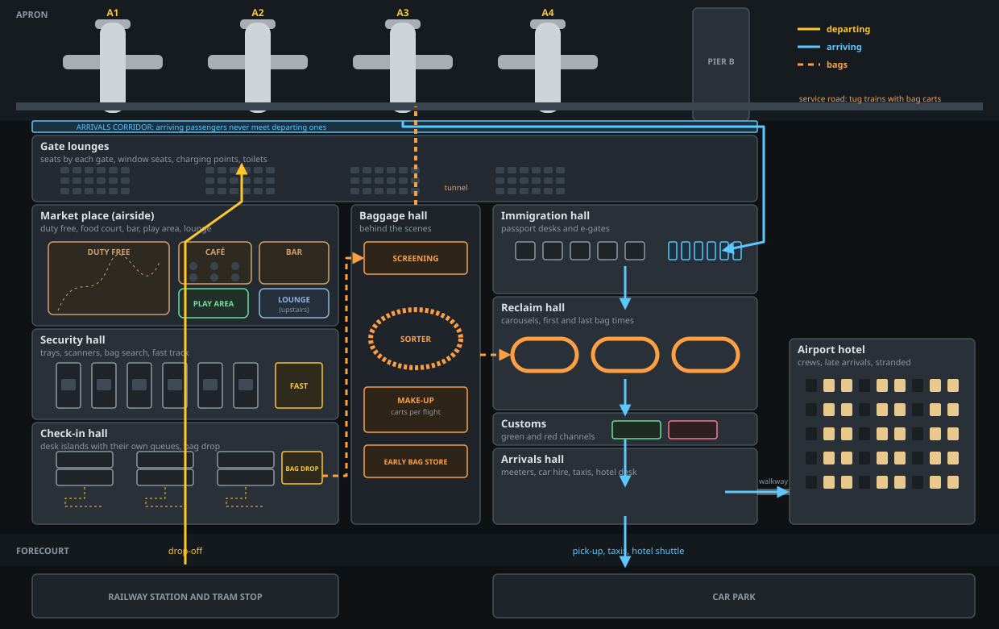

# A terminal that works like a real one

Issue: #17 · Status: Proposed

## What the player gets

Every part of the terminal becomes a place to watch and run: check-in, security, passport control, the shops, the baggage system and the hotel. They're laid out the way real airports are, in every layout.

Passengers spend their time doing believable things. They:
- queue at their airline's desks and drop their bags;
- empty their pockets at security;
- wander through duty free;
- eat, drink and play;
- wait for their gate to be called;
- meet their families in arrivals.

Every choice shows up on the map as queues, crowds, full cafés, bags on belts and lit hotel windows.

## What they see

**A proper floor plan.** Today check-in, security, passport control and reclaim sit in one strip that's the same in every layout. Instead, each layout's main building gets halls in the order real airports use them, with departing and arriving passengers kept apart. The plan below is Classic.

- **Departing passengers:** forecourt, check-in hall, security hall, the market place (airside shops), then gate lounges.
- **Arriving passengers:** the arrivals corridor, immigration hall, reclaim hall, customs, then the arrivals hall, and out to the forecourt, the station or the hotel.
- **Bags:** the baggage hall sits between the two sides, with a tunnel to the apron.

**Check-in.**
- Islands of desks, back to back, each with its own zig-zag queue.
- Kiosks print boarding passes, then passengers with bags go to bag drop. Online passengers with bags go straight to bag drop.
- Bags ride a belt from each desk into the baggage hall.

**Security.**
- Boarding-pass gates at the entrance.
- Divest tables where passengers load trays, the scanners, and benches to repack.
- A search table where some bags are pulled aside and opened.
- The fast track lane, and a family and assistance lane.
- CT scanners (a new upgrade) let liquids stay in bags: quicker trays and fewer searches.

**Passport control and customs.**
- The immigration hall has desks and e-gates, with separate queues for e-gate passports and for everyone.
- Passengers off domestic flights walk straight past.
- After reclaim, customs has green and red channels. A few passengers are stopped and their cases opened.

**Shops with people inside.**
- Each shop is drawn with its inside: shelves and tills, café tables, bar stools, restaurant tables, the lounge's armchairs and buffet.
- Passengers walk in, browse, queue to pay and sit down.
- A shop has room for so many. When a café is full, people go elsewhere or give up.
- **Walk-through duty free** (a Masterplan plan) routes everyone through the shop after security.

**Passengers doing more.**
- **Waiting for the gate.** Passengers wait in the market place until the board shows their gate (45 minutes before departure), then walk to it. A new policy calls gates early (60 min, calmer boarding) or late (30 min, more shopping).
- **Gate lounges** have a set number of seats. Passengers stand when they're full, and a crowded lounge costs a little rating.
- **Across the terminal:**
  - families use the play area;
  - groups gather at the bar;
  - business travellers use the lounge;
  - others sit by the windows watching planes, or charge their phones.
- **In arrivals,** meeters wait with signs, and people head to the taxi rank, car hire or the hotel desk.

**Baggage you can see.**
- **On the map:**
  - bags travel from check-in through screening and the sorter to make-up;
  - they wait there in carts for their flight;
  - tug trains take them to the stand.
- **Arriving bags** come off the plane and go by tug train to the baggage hall, then onto a carousel. The screens show first-bag and last-bag times.
- **Transfer bags** go from one flight to the next. Tight connections can miss, and a bag that misses costs a courier fee and some rating.
- **Early bags** checked hours before their flight wait in the early bag store.
- **On the board:** "BAGS ON BELT 2", and "BAGS DELAYED" when the system backs up.

**An airport hotel worth building.**
- **The building:** it has rooms (more with each level). Its windows light up as rooms are taken, and a walkway joins it to the arrivals hall.
- **Guests:**
  - passengers who land after the last train;
  - passengers on early flights who stay the night before;
  - long connections;
  - conference delegates;
  - your airline's crews, who rest better and are ready sooner;
  - passengers stranded when fog or storms cancel flights overnight. You owe them a room: yours is cheap, and a city hotel is dear and hurts your rating.
- **Its card** in Sales shows tonight's occupancy, guests by kind, room prices (cheap, standard or premium) and takings.

**In the panel.** The Terminal tab gains three sub-tabs: Departures (check-in and security), Arrivals (immigration, reclaim and customs) and Baggage. Sales keeps the shops, and the hotel card goes in Sales › Landside.

**On phones.** The panels fit 320 px. Tapping a hall's name on the map flies the camera to it.

## How it works

- **Halls are rooms.** The airside rooms and doorways (`route`, `walk`) extend landside.
  - Each layout lists its halls and the counters, lanes, desks, carousels, shop units and seats in them.
  - Passengers route through halls exactly as they do airside, so walks come from each layout's real distances.
  - The other layouts use the same halls, fitted to their main building:
    - the Round terminal's halls wrap the landside half of the ring;
    - Midfield's sit in its main terminal;
    - the Satellite's and the Starfish's sit in their main buildings.
- **Numbers to start from,** tuned with the bot:
  - bag drop takes 40% of a full check-in;
  - 1 bag in 12 is searched, taking 2 min (1 in 30 with CT scanners);
  - 60% of passports suit e-gates, which are three times quicker;
  - domestic flights are about a third of short-haul routes;
  - 1 arriving passenger in 40 is checked at customs;
  - the sorter's capacity is the existing Automated baggage system's levels;
  - hotel rooms come in blocks of 40 per level.
- **Speed.**
  - Bags are counts at each stage of each flight, and only a sample is drawn.
  - Shops have room for a set number, which caps how many people are inside at once.
  - The `perf` budget still holds for a level 9 airport and a sixteen-stand Midfield.
- **Unlocks.**
  - Most of it is there from the start in a basic form.
  - New upgrades appear in the Terminal tab by level: bag drop, CT scanners, more carousels, the early bag store, make-up positions.
  - Walk-through duty free and CT scanners are also Masterplan plans.
  - Locked items stay hidden.
- **Managers and recommendations.**
  - A new **duty manager** setting (on by default) calls gates and prices hotel rooms by what earns most, like the transport manager.
  - The Rostering system keeps opening counters and lanes.
  - The advisor's tips point at the worst bottleneck: the longest queue, the fullest café, bags backing up, or a full hotel.

## Saved state

- **New fields:**
  - new `G.lv` upgrade keys (default 0);
  - `G.pol.gates` (when gates are called);
  - `G.hotelPrice`;
  - `G.set.autoDuty`.
- **Old saves:** each gets its layout's new floor plan, with today's desks, lanes and carousels moved into it. Bags on their way when a save loads count as already in the hold.
- **Nothing is renamed or removed.** `desks`, `kiosks`, `lanes`, `officers`, `egates`, `bagsys` and `hotel` keep their levels and meaning.

## Balance

- **Pacing stays inside the baselines** on seeds 1–3, keeping Classic and rebuilding.
- **New income:** a useful hotel and fuller shops.
- **New costs:** missed bags, rooms for stranded passengers, and search staff.
- **The bot** buys the new upgrades the way a sensible player would.
- **Rating** now also reacts to:
  - lounge seating;
  - full shops;
  - missed bags;
  - how stranded passengers are looked after.

## Checks

- **`rules`:**
  - every layout's halls are convex, reachable and joined in the right order;
  - every desk, lane, booth, carousel, shop unit and seat sits inside its hall;
  - domestic arrivals skip immigration;
  - every checked bag ends in a hold or is counted as missed;
  - every arriving bag reaches a carousel;
  - shops never hold more than their room;
  - the hotel is never overbooked;
  - crews at the hotel are ready sooner.
- **`layouts`:** each layout's terminal plays two hours fully built, with a screenshot of each floor plan.
- **`saves`:** every old save loads into the new terminal.
- **`perf`:** within budget with the new terminal.

## Files

- **New:**
  - `42-terminal` (halls and floor plans);
  - `43-departures` (check-in, bag drop, security);
  - `44-arrivals` (immigration, customs, the arrivals hall);
  - `45-baggage`;
  - `46-market` (shops, gate calls, seats, what passengers do);
  - `47-hotel`.
- **Changed:**
  - `07-passengers`, `08-stands` and `12-drawing`;
  - `39`–`41` (each layout's halls);
  - `14-board` and `15-panel`;
  - `01-constants` (upgrades) and `22-save`.

## Order of work

1. **The floor plan** comes first, since everything else sits on it.
   - Halls as rooms for every layout, with Classic's new plan.
   - Today's desks, lanes, booths and carousels move into their halls.
   - Passengers route through them.
   - Proof: every check green, and pacing within noise of today.
2. **Five parts in parallel,** each on its own branch from step 1 and each in its own session:
   1. departures: check-in islands, bag drop, security;
   2. arrivals: immigration, domestic flights, customs, the arrivals hall;
   3. the baggage system;
   4. shops and passengers' time airside: insides, walk-through duty free, gate calls, seats, activities;
   5. the hotel.

   Step 1 fixes where they meet: where a bag passes from check-in to the baggage hall and from the baggage hall to a carousel, and where passengers pass from one hall to the next.
3. **Bringing it together:**
   - the other layouts' floor plans;
   - balance with the bot on seeds 1–3;
   - screenshots, What's new, save fixtures and docs.

## Left out

- **Two floors.** Real terminals often put departures upstairs. Here it's one level, with departing and arriving passengers kept apart by the corridor.
- **Staff as people.** Desk agents and officers are drawn at their posts, but aren't simulated one by one.
- **Shop leases and prices.**
- **Security scares and emergencies.**
